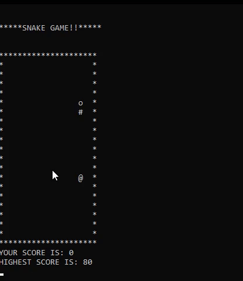

# SnakegameinC
---
## Table of contents
- [Description](#Description)
- [A bit of problem](#problem)
---
## Description
This is just a small snake game created in C using basic functions. One of the Key function used is [kbhit()](https://www.cprogramming.com/fod/kbhit.html) and getch(). Once you learn kbhit u can easily create other similar games. It also uses the fileIO functions for tracking highscore. Use 'WSAD' to control the snake.

```kbhit()```



---
## A bit of problem
One big problem is it doesn't work properly on linux because of the conio.h header file. Apparently conio.h is a C header file that was used with old MS-DOS compilers to create text-based user interfaces. Compilers that target other operating systems, such as Linux-based, 32-bit Windows and OS/2 provided equivalent functionality through other header files and libraries.